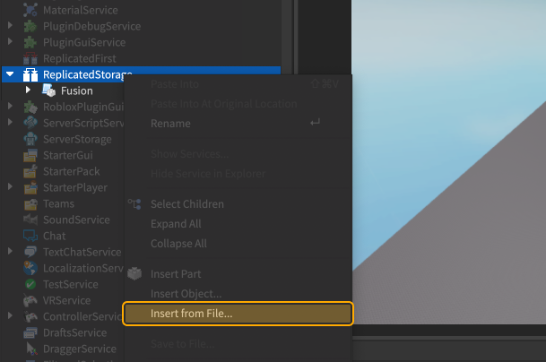

# Installing Stellar

## Methods
Stellar is distributed as a module. Installing Stellar may differ depending on
your setup.

### Install via Roblox

If you are creating games in Roblox Studio, Stellar can be imported as a Roblox model.

First, [install Fusion](https://elttob.uk/Fusion/0.3/tutorials/get-started/installing-fusion/#install-as-source-code)
via Roblox, if you haven't already.

Head over to [Stellar's releases page](https://github.com/znotfireman/Stellar/releases).
Click the 'Assets' dropdown to view the downloadable files:

Click on the `Stellar.rbxm` file to download it. This model contains Stellar.
In Roblox Studio, locate where you've installed Fusion, right-click on it's
directory, and select "Insert from File":

<figure markdown="span">

</figure>

Select the `Stellar.rbxm` file you just downloaded. You should see a module
script named "Stellar" next to Fusion!

### Install via Wally

If you are synchronizing external files into Roblox Studio, Stellar can be
imported as a [Wally](https://wally.run/)  package.

First, [install Fusion](https://elttob.uk/Fusion/0.3/tutorials/get-started/installing-fusion/#install-as-source-code)
either from source code or Roblox, if you haven't already.

Add this line to your `wally.toml`:
```toml title="wally.toml"
[dependencies]
Stellar = "znotfireman/stellar@0.1.0"
```

Install your packages:
```sh
wally install
```

This will install Stellar to Wally's `Packages` directory, though the actual
location of the folder in-game depends on your Rojo project configuration, but
it is usually located in `ReplicatedStorage`.

### Install via Source

If you're using vanilla Luau, or if you are synchronizing external files into
Roblox Studio, Stellar can be imported as pre-converted source code.

First, [install Fusion](https://elttob.uk/Fusion/0.3/tutorials/get-started/installing-fusion/#install-as-source-code) via
source code, if you haven't already.

Head over to [Stellar's releases page](https://github.com/znotfireman/Stellar/releases).
Click the "Assets" dropdown to view the downloadable files:

Click on `Stellar 0.x.x build` to download it. This file contains Stellar.
Inside the zip, copy its contents - it may be inside another folder.

Create a new folder inside your project named "Stellar", and place it wherever
you keep your libraries. For example, you might place it inside a `vendor` or
`shared` folder.

Paste the contents of the zip file into the newly created folder.

---

## Setting Up A Test Script

Now that you have installed Stellar, you can set up a script for testing:

=== "For Roblox"

	1. Create a `LocalScript` in `StarterGui` or `StarterPlayerScripts`.
	2. Remove the default code, and paste the following code in:
	```lua
	local ReplicatedStorage = game:GetService("ReplicatedStorage")
	local Fusion = require(ReplicatedStorage.Fusion)
	local Stellar = require(ReplicatedStorage.Stellar)
	```
	3. Playtest the game and open the console. If there are no errors,
	   everything was set up correctly!

=== "For Luau/external editors"
	1. Create a script next to Fusion and Stellar, named however you want.
	2. Depending on your set up, paste any of the appropriate scripts:
	<span markdown>
	=== "Rojo"
		```lua
		local ReplicatedStorage = game:GetService("ReplicatedStorage")
		local Fusion = require(ReplicatedStorage.Fusion)
		local Stellar = require(ReplicatedStorage.Stellar)
		```
		3. Playtest the game and open the console. If there are no errors,
	       everything was set up correctly!
	=== "Darklua"
		```lua
		local Fusion = require("../Fusion")
		local Stellar = require("../Stellar")
		```
		3. Run the test script and open the console. If there are no errors,
	       everything was set up correctly!
	=== "Vanilla Luau"
		```lua
		local Fusion = require("../Fusion/init.luau")
		local Stellar = require("../Stellar/init.luau")
		```
		3. Run the test script and open the console. If there are no errors,
	       everything was set up correctly!
	</span>

??? failure "My script didn't work!"
	```
	Stellar is not a valid member of ReplicatedStorage "ReplicatedStorage"
	```
	If you're seeing this error, then your script can't find Stellar.

	This code assumes you've placed both Fusion and Stellar as siblings under
	ReplicatedStorage. If you've installed both elsewhere, you'll need to tweak
	both `require`s to point to the correct location.

	If both looks like it points to the correct location, refer back to the
	previous section and double-check you've set everything up properly. Make
	sure under ReplicatedStorage, there's two ModuleScripts appropriately named
	"Fusion" and "Stellar".

	---

	```
	[Stellar] Stellar got invalid Fusion installation; incompatible version 0.2, Stellar requires at minimum Fusion 0.3.
		ID: invalidFusionInstallation
	```
	If you're seeing this error, then you got an outdated version of Fusion.

	Stellar requires a Fusion installation of version 0.3, specifically the
	push-pull-execution branch.
